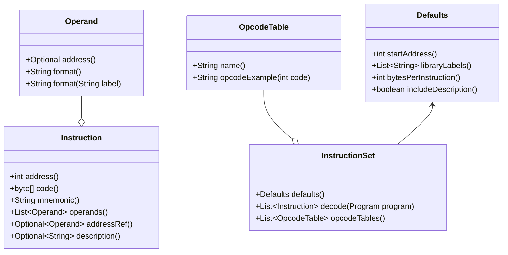

# Disassembler API

The AppleCommander disassembler API is a reusable component that can be utilized by other Java projects.
The easiest mechanism is to use a dependency manager such as Gradle or Maven.

<details>
<summary>Maven</summary>

```xml
<dependency>
    <groupId>org.applecommander</groupId>
    <artifactId>acdasm</artifactId>
    <version>6.0</version>
</dependency>
```
</details>

<details>
<summary>Gradle</summary>

```groovy
dependencies {
  implementation 'org.applecommander:acdasm:6.0'
}
```
</details>

## API

Invoking the disassembler is done through a "builder" type interface. For example:

```java
List<Instruction> assembly = Disassembler.with(code)
        .startingAddress(startAddress)
        .bytesToSkip(offset)
        .bytesToDecode(length)
        .use(instructionSet)
        .section(libraries)
        .decode(labels);
```

The only required components are `code` and the `InstructionSet`.

The following instruction sets are available:

| Name                        | Creation                                            |
|:----------------------------|:----------------------------------------------------|
| 6502                        | `InstructionSet6502.for6502()`                      |
| 6502 + Illegal Instructions | `InstructionSet6502.for6502withIllegalInstructions` |
| 65C02                       | `InstructionSet6502.for65C02()`                     |
| SWEET-16                    | `InstructionSetSWEET16.forSWEET16()`                |
| 6502 + SWEET-16             | `InstructionSet6502Switching.withSwitching()`       |
| Z80                         | `InstructionSetZ80.forZ80()`                        |
| p-code                      | `InstructionSetPCode.forApplePascal()`              |

As a minimal example, this would setup to disassemble 6502 code:

```java
byte[] code = File.readAllBytes(file);
List<Instruction> assembly = Disassembler.with(code)
    .use(InstructionSet6502.for6502())
    .decode();
```

If you want the labels, create a `Map<String,Integer>` to capture them and pass it in to the `decode(Map)` method.

## Important Interfaces/Classes/Records 

The `Dissassembler` decode interface returns a list of `Instruction` components. Each component contains
the address, bytes involved, the opcode mnemonic, and a list of operands. The operands have two format
options: `format()` will format the operand as expected while `format(String)` will replace an address
with the label instead. To determine if an operand contains an address, the `address()` method returns
a Java Optional class, so use it as applicable as the return value is never null.



If there is a new instruction set to add, implement the `InstructionSet`. The instruction set also
supplies `Defaults` that have various attributes that can be passed into the `Disassembler`.

> Note that an instruction set not only decodes a program but also supplies opcode examples for 
> the `GenerateMarkdown` program. Since the instruction sets are manually added into this 
> application, the `opcodeTables()` method can likely be ignored.
